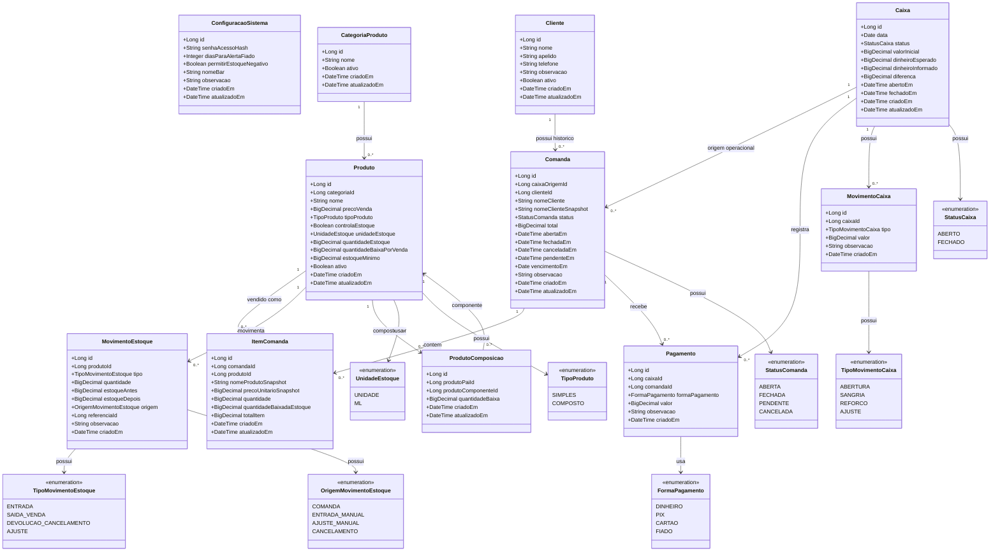

# Diagrama de Classes Global

Fonte real: `app/core/domain/models.py` e `app/core/domain/enums/`.

## Observacoes

- `ConfiguracaoSistema` existe no modelo de dominio, mas o modulo operacional
  de Configuracoes ainda esta pendente.
- `FormaPagamento.FIADO` existe no enum, mas nao representa pagamento recebido:
  fiado vira comanda `PENDENTE` e a quitacao usa `DINHEIRO`, `PIX` ou `CARTAO`.
