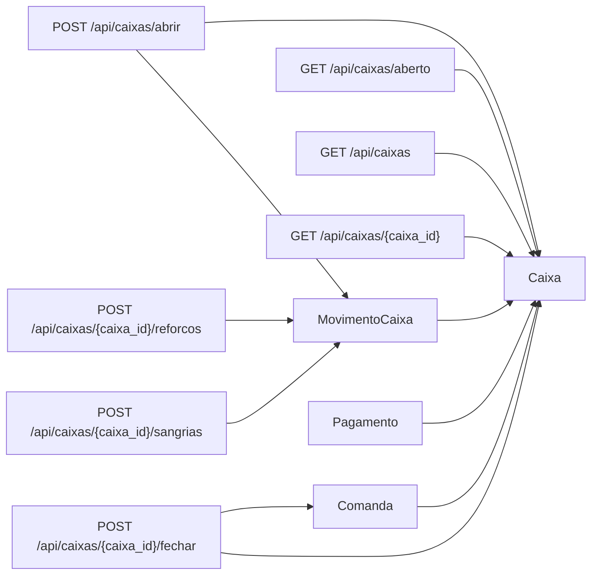

# Diagrama do Modulo - Caixa Diario

## Status

Implementado.

## Objetivo

Controlar abertura, movimentacoes fisicas, pagamentos vinculados e fechamento do
caixa operacional.

## Entidades envolvidas

- `Caixa`
- `MovimentoCaixa`
- `Pagamento`
- `Comanda`
- `StatusCaixa`
- `TipoMovimentoCaixa`

## Casos de uso envolvidos

- Abrir, consultar, listar e fechar caixa.
- Registrar reforco e sangria.
- Calcular dinheiro esperado e diferenca.
- Bloquear fechamento com comandas abertas.
- Permitir fechamento com comandas pendentes.
