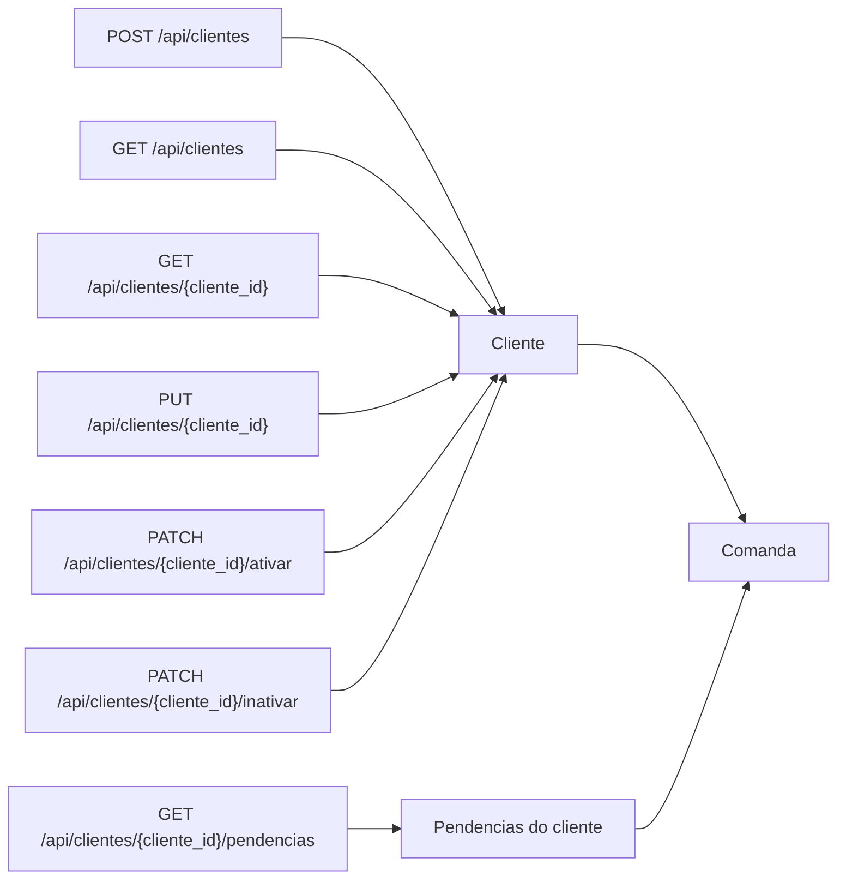

# Diagrama do Modulo - Clientes

## Status

Implementado.

## Objetivo

Manter cadastro simples de clientes para historico e fiado, sem bloquear a
criacao rapida de comandas por nome/apelido.

## Entidades envolvidas

- `Cliente`
- `Comanda`

## Casos de uso envolvidos

- Cadastrar, listar, consultar, editar, ativar e inativar cliente.
- Validar duplicidade de cliente ativo por nome ou telefone normalizados.
- Consultar pendencias do cliente.
- Manter historico e pendencias de clientes inativos.
