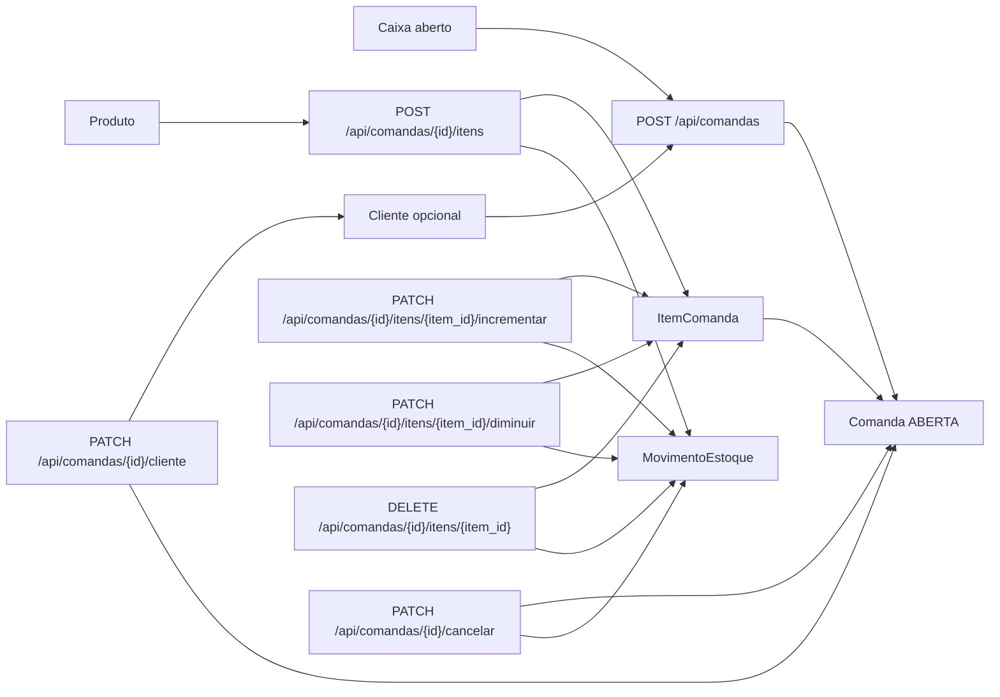

# Diagrama do Modulo - Comandas e Itens

## Status

Implementado.

## Objetivo

Registrar consumo operacional, recalcular totais e movimentar estoque
automaticamente a partir dos itens de comanda.

## Entidades envolvidas

- `Comanda`
- `ItemComanda`
- `Cliente`
- `Caixa`
- `Produto`
- `MovimentoEstoque`

## Casos de uso envolvidos

- Criar comanda rapida ou com cliente cadastrado.
- Exigir caixa aberto para nova comanda.
- Vincular cliente a comanda aberta.
- Adicionar, incrementar, diminuir e remover itens.
- Cancelar comanda.
- Baixar e devolver estoque automaticamente.
