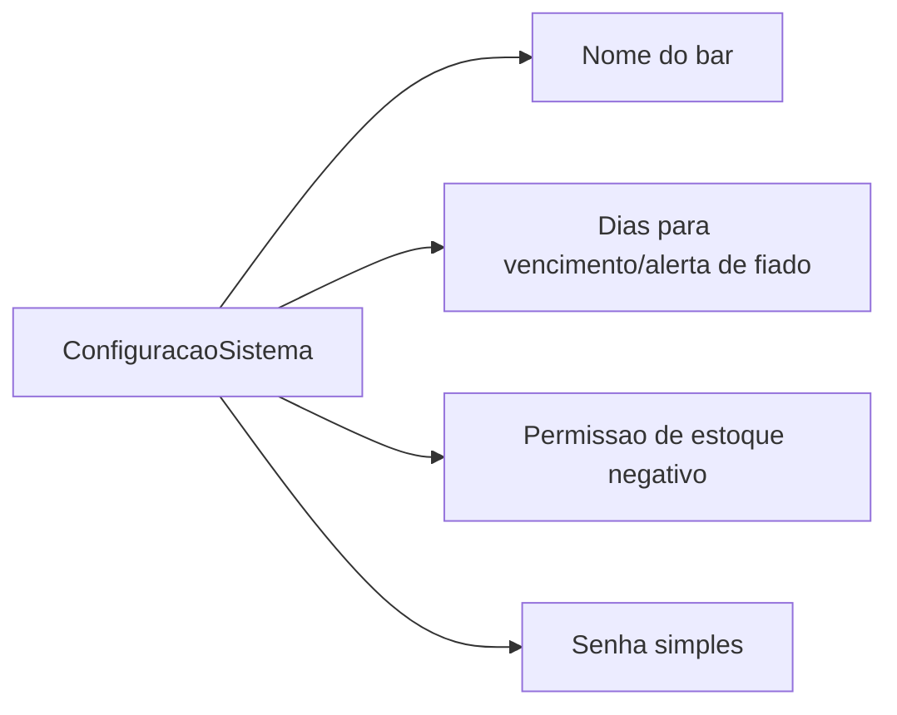

# Diagrama do Modulo - Configuracoes

## Status

Pendente.

## Objetivo

Futuramente parametrizar comportamento operacional simples do MVP.

## Entidades envolvidas

- `ConfiguracaoSistema`

## Endpoints envolvidos

A definir. Nao ha endpoints reais de configuracao hoje.

## Casos de uso previstos

- Configurar nome do bar.
- Configurar dias para vencimento/alerta de fiado.
- Configurar permissao de estoque negativo.
- Configurar senha simples.
