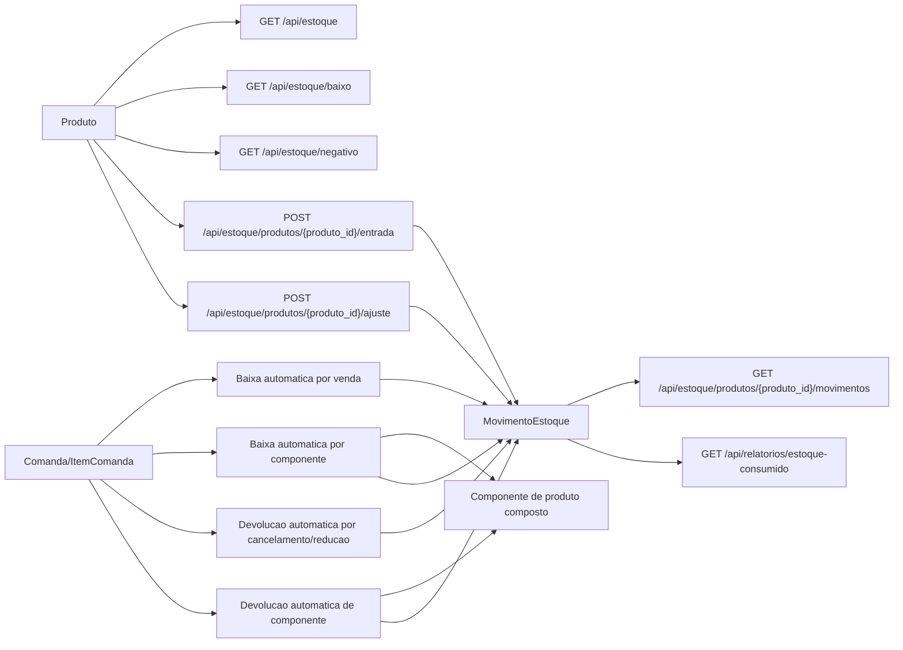

# Diagrama do Modulo - Estoque

## Status

Implementado.

## Objetivo

Consultar saldo de produtos e registrar movimentos manuais ou automaticos de
estoque.

## Entidades envolvidas

- `Produto`
- `ProdutoComposicao`
- `MovimentoEstoque`
- `TipoMovimentoEstoque`
- `OrigemMovimentoEstoque`

## Casos de uso envolvidos

- Consultar estoque, baixo e negativo.
- Registrar entrada e ajuste manual.
- Consultar movimentos.
- Registrar baixa e devolucao automaticas via comanda.
- Registrar baixa e devolucao automaticas por componente de produto composto.
- Consultar consumo fisico de estoque por movimentos.
