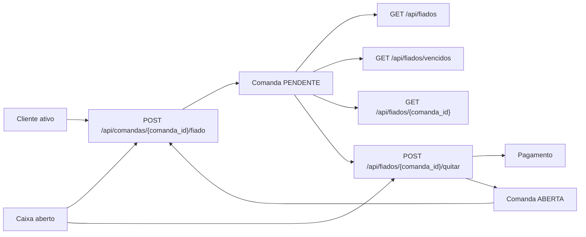

# Diagrama do Modulo - Fiado / Pendencias

## Status

Implementado.

## Objetivo

Transformar consumo nao recebido em pendencia rastreavel e permitir quitacao
posterior com pagamento real.

## Entidades envolvidas

- `Cliente`
- `Comanda`
- `Pagamento`
- `Caixa`
- `FormaPagamento`
- `StatusComanda`

## Casos de uso envolvidos

- Marcar comanda como fiado.
- Exigir cliente cadastrado e caixa aberto.
- Definir vencimento e listar vencidos.
- Quitar pendencia com DINHEIRO, PIX ou CARTAO.
- Manter pendencias de cliente inativo visiveis.
