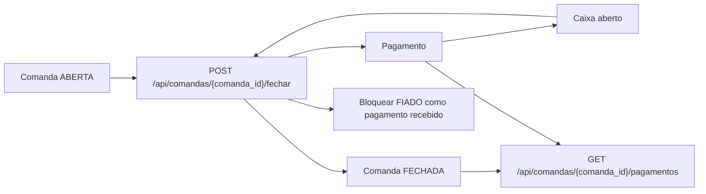

# Diagrama do Modulo - Pagamentos e Fechamento

## Status

Implementado.

## Objetivo

Fechar comandas abertas com recebimento real e vincular pagamentos ao caixa
aberto.

## Entidades envolvidas

- `Comanda`
- `Pagamento`
- `Caixa`
- `FormaPagamento`
- `StatusComanda`

## Casos de uso envolvidos

- Fechar comanda com DINHEIRO, PIX ou CARTAO.
- Listar pagamentos da comanda.
- Bloquear FIADO como pagamento recebido.
- Atualizar dinheiro esperado apenas quando a forma for DINHEIRO.
