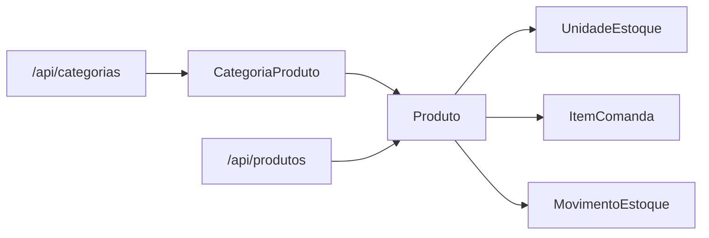

# Diagrama do Modulo - Produtos e Categorias

## Status

Implementado.

## Objetivo

Manter o cadastro vendavel usado por estoque, comandas e relatorios futuros.

## Entidades envolvidas

- `CategoriaProduto`
- `Produto`
- `UnidadeEstoque`
- `ItemComanda`
- `MovimentoEstoque`

## Casos de uso envolvidos

- Cadastrar, listar, consultar, editar, ativar e inativar categorias.
- Cadastrar, listar, consultar, editar, ativar e inativar produtos.
- Configurar controle de estoque, unidade, baixa por venda e estoque minimo.
