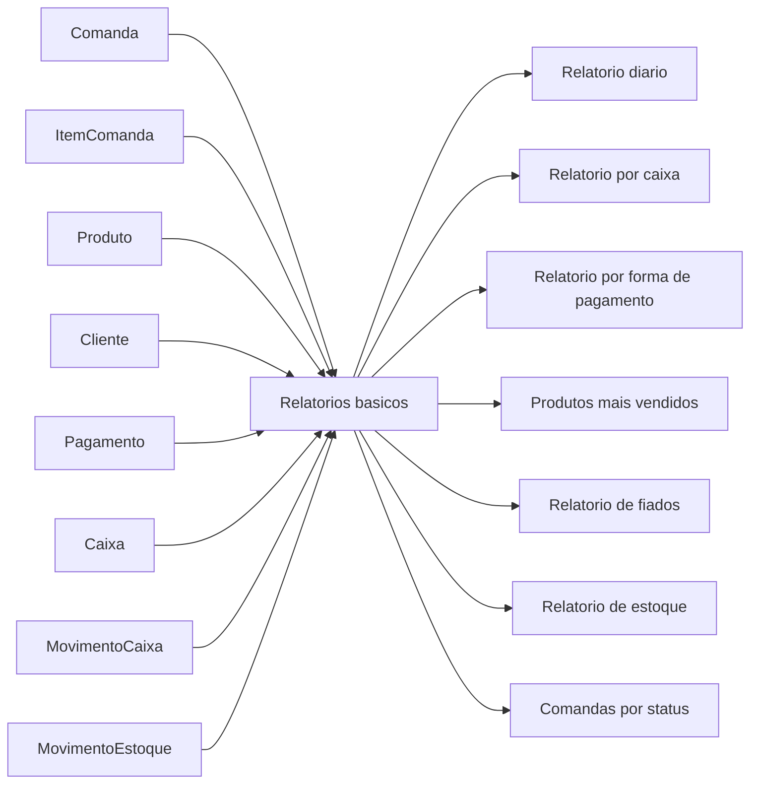

# Diagrama do Modulo - Relatorios

## Status

Pendente.

## Objetivo

Consolidar dados operacionais ja existentes em consultas de apoio a gestao.

## Entidades envolvidas

- `Comanda`
- `ItemComanda`
- `Produto`
- `Cliente`
- `Pagamento`
- `Caixa`
- `MovimentoCaixa`
- `MovimentoEstoque`

## Endpoints envolvidos

A definir no modulo 8. Nenhum endpoint de relatorio existe hoje.

## Casos de uso previstos

- Gerar relatorio diario.
- Gerar relatorio por caixa.
- Gerar relatorio por forma de pagamento.
- Gerar relatorio de produtos mais vendidos.
- Gerar relatorio de fiados.
- Gerar relatorio de estoque.
- Gerar relatorio de comandas por status.
