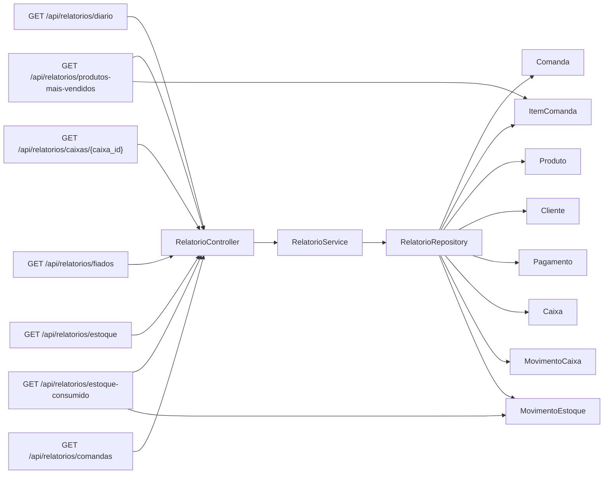

# Diagrama do Modulo - Relatorios

## Status

Implementado.

## Objetivo

Consolidar dados operacionais ja existentes em consultas de apoio a gestao.

## Entidades envolvidas

- `Comanda`
- `ItemComanda`
- `Produto`
- `Cliente`
- `Pagamento`
- `Caixa`
- `MovimentoCaixa`
- `MovimentoEstoque`

## Endpoints envolvidos

- `GET /api/relatorios/diario`
- `GET /api/relatorios/caixas/{caixa_id}`
- `GET /api/relatorios/produtos-mais-vendidos`
- `GET /api/relatorios/fiados`
- `GET /api/relatorios/estoque`
- `GET /api/relatorios/estoque-consumido`
- `GET /api/relatorios/comandas`

## Casos de uso implementados

- Gerar relatorio diario.
- Gerar relatorio por caixa.
- Gerar relatorio de produtos mais vendidos.
- Gerar relatorio de fiados.
- Gerar relatorio de estoque.
- Gerar relatorio de estoque consumido.
- Gerar relatorio de comandas por status.

## Regra central

- Produtos mais vendidos usam `ItemComanda`, mostrando o produto vendido ao
  cliente.
- Estoque consumido usa `MovimentoEstoque`, mostrando o produto fisicamente
  movimentado no estoque.
