# Diagrama de Casos de Uso Global

Visao geral dos casos atuais e pendentes do MVP.

```mermaid
flowchart LR
    ATENDENTE["Atendente / Usuario do Sistema"]
    RESP_CAIXA["Responsavel pelo Caixa"]
    CLIENTE_BAR["Cliente do Bar"]
    ADMIN["Administrador / Dono do Bar"]

    subgraph ACESSO["Acesso / Senha simples - pendente"]
        UC_ACESSAR(["Acessar sistema com senha"])
        UC_ALTERAR_SENHA(["Alterar senha simples"])
    end

    subgraph PRODUTOS["Produtos e Categorias - implementado"]
        UC_CAD_CATEGORIA(["Cadastrar categoria"])
        UC_LIST_CATEGORIA(["Listar/consultar categoria"])
        UC_EDIT_CATEGORIA(["Editar categoria"])
        UC_ATIVAR_CATEGORIA(["Ativar/inativar categoria"])
        UC_CAD_PRODUTO(["Cadastrar produto"])
        UC_LIST_PRODUTO(["Listar/consultar produto"])
        UC_EDIT_PRODUTO(["Editar produto"])
        UC_ATIVAR_PRODUTO(["Ativar/inativar produto"])
        UC_DEF_ESTOQUE(["Definir controle de estoque"])
    end

    subgraph ESTOQUE["Estoque - implementado"]
        UC_VER_ESTOQUE(["Consultar estoque"])
        UC_VER_BAIXO(["Consultar estoque baixo"])
        UC_VER_NEGATIVO(["Consultar estoque negativo"])
        UC_ENTRADA(["Entrada manual"])
        UC_AJUSTE(["Ajuste manual"])
        UC_MOV_ESTOQUE(["Consultar movimentos"])
        UC_BAIXA_AUTO(["Baixar estoque automaticamente"])
        UC_DEVOLVE_AUTO(["Devolver estoque automaticamente"])
    end

    subgraph CLIENTES["Clientes - implementado"]
        UC_CAD_CLIENTE(["Cadastrar cliente"])
        UC_EDIT_CLIENTE(["Editar cliente"])
        UC_CONS_CLIENTES(["Consultar clientes"])
        UC_ATIVAR_CLIENTE(["Ativar cliente"])
        UC_INATIVAR_CLIENTE(["Inativar cliente"])
        UC_PEND_CLIENTE(["Consultar pendencias do cliente"])
        UC_DUP_CLIENTE(["Validar duplicidade de cliente ativo"])
    end

    subgraph COMANDAS["Comandas e Itens - implementado"]
        UC_CRIAR_RAPIDA(["Criar comanda rapida por nome/apelido"])
        UC_CRIAR_CLIENTE(["Criar comanda com cliente cadastrado"])
        UC_VINC_CLIENTE(["Vincular cliente a comanda aberta"])
        UC_EXIGE_CAIXA(["Exigir caixa aberto para criar comanda"])
        UC_LIST_COMANDAS(["Listar/consultar comandas"])
        UC_ADD_ITEM(["Adicionar produto a comanda"])
        UC_INC_ITEM(["Aumentar quantidade do item"])
        UC_DEC_ITEM(["Diminuir quantidade do item"])
        UC_REM_ITEM(["Remover item"])
        UC_CANCELAR(["Cancelar comanda"])
        UC_RECALCULAR(["Recalcular total"])
    end

    subgraph PAGAMENTOS["Pagamentos e Fechamento - implementado"]
        UC_FECHAR_DINHEIRO(["Fechar comanda com DINHEIRO"])
        UC_FECHAR_PIX(["Fechar comanda com PIX"])
        UC_FECHAR_CARTAO(["Fechar comanda com CARTAO"])
        UC_BLOQ_FIADO_PGTO(["Bloquear FIADO como pagamento recebido"])
        UC_LIST_PAGTOS(["Listar pagamentos da comanda"])
        UC_PGTO_CAIXA(["Vincular pagamento ao caixa aberto"])
    end

    subgraph FIADO["Fiado / Pendencias - implementado"]
        UC_FIADO_PEND(["FIADO vira pendencia"])
        UC_MARCAR_FIADO(["Marcar comanda como fiado"])
        UC_EXIGE_CLIENTE_FIADO(["Exigir cliente cadastrado para fiado"])
        UC_VENCIMENTO(["Definir vencimento da pendencia"])
        UC_LIST_FIADOS(["Listar fiados pendentes"])
        UC_LIST_VENCIDOS(["Listar fiados vencidos"])
        UC_CONS_FIADO(["Consultar pendencia por comanda"])
        UC_QUITAR(["Quitar fiado"])
        UC_PGTO_QUITACAO(["Registrar pagamento de quitacao"])
        UC_INATIVO_VISIVEL(["Manter pendencias de cliente inativo visiveis"])
    end

    subgraph CAIXA["Caixa Diario - implementado"]
        UC_ABRIR_CAIXA(["Abrir caixa do dia"])
        UC_CAIXA_ABERTO(["Consultar caixa aberto"])
        UC_LIST_CAIXAS(["Listar caixas"])
        UC_CAIXA_ID(["Consultar caixa por ID"])
        UC_SANGRIA(["Registrar sangria"])
        UC_REFORCO(["Registrar reforco"])
        UC_FECHAR_CAIXA(["Fechar caixa"])
        UC_BLOQ_ABERTAS(["Bloquear fechamento com comandas abertas"])
        UC_PERM_PENDENTES(["Permitir fechamento com comandas pendentes"])
        UC_DINHEIRO(["Calcular dinheiro esperado"])
        UC_DIFERENCA(["Calcular diferenca de caixa"])
    end

    subgraph RELATORIOS["Relatorios - implementado"]
        UC_REL_DIA(["Gerar relatorio diario"])
        UC_REL_CAIXA(["Gerar relatorio por caixa"])
        UC_REL_PRODUTOS(["Gerar relatorio de produtos mais vendidos"])
        UC_REL_FIADOS(["Gerar relatorio de fiados"])
        UC_REL_ESTOQUE(["Gerar relatorio de estoque"])
        UC_REL_STATUS(["Gerar relatorio de comandas por status"])
    end

    subgraph CONFIG["Configuracoes - pendente"]
        UC_CONF_BAR(["Configurar nome do bar"])
        UC_CONF_FIADO(["Configurar dias para vencimento/alerta de fiado"])
        UC_CONF_ESTOQUE(["Configurar permissao de estoque negativo"])
        UC_CONF_SENHA(["Configurar senha simples"])
    end

    subgraph FRONT["Frontend operacional - futuro"]
        UC_TELA_OPERACAO(["Operar API por interface visual"])
    end

    ATENDENTE --> UC_CRIAR_RAPIDA
    ATENDENTE --> UC_CRIAR_CLIENTE
    ATENDENTE --> UC_VINC_CLIENTE
    ATENDENTE --> UC_LIST_COMANDAS
    ATENDENTE --> UC_ADD_ITEM
    ATENDENTE --> UC_INC_ITEM
    ATENDENTE --> UC_DEC_ITEM
    ATENDENTE --> UC_REM_ITEM
    ATENDENTE --> UC_CANCELAR
    ATENDENTE --> UC_FECHAR_DINHEIRO
    ATENDENTE --> UC_FECHAR_PIX
    ATENDENTE --> UC_FECHAR_CARTAO
    ATENDENTE --> UC_MARCAR_FIADO
    ATENDENTE --> UC_LIST_FIADOS
    ATENDENTE --> UC_QUITAR
    ATENDENTE --> UC_CONS_CLIENTES

    RESP_CAIXA --> UC_ABRIR_CAIXA
    RESP_CAIXA --> UC_CAIXA_ABERTO
    RESP_CAIXA --> UC_LIST_CAIXAS
    RESP_CAIXA --> UC_CAIXA_ID
    RESP_CAIXA --> UC_SANGRIA
    RESP_CAIXA --> UC_REFORCO
    RESP_CAIXA --> UC_FECHAR_CAIXA
    RESP_CAIXA --> UC_LIST_PAGTOS

    ADMIN --> UC_CAD_CATEGORIA
    ADMIN --> UC_CAD_PRODUTO
    ADMIN --> UC_VER_ESTOQUE
    ADMIN --> UC_CAD_CLIENTE
    ADMIN --> UC_REL_DIA
    ADMIN --> UC_REL_CAIXA
    ADMIN --> UC_REL_PRODUTOS
    ADMIN --> UC_REL_FIADOS
    ADMIN --> UC_REL_ESTOQUE
    ADMIN --> UC_REL_STATUS
    ADMIN --> UC_CONF_BAR
    ADMIN --> UC_CONF_FIADO
    ADMIN --> UC_CONF_ESTOQUE
    ADMIN --> UC_CONF_SENHA

    CLIENTE_BAR --> UC_CRIAR_RAPIDA
    CLIENTE_BAR --> UC_FECHAR_DINHEIRO
    CLIENTE_BAR --> UC_FECHAR_PIX
    CLIENTE_BAR --> UC_FECHAR_CARTAO
    CLIENTE_BAR --> UC_MARCAR_FIADO
    CLIENTE_BAR --> UC_QUITAR

    UC_CRIAR_RAPIDA --> UC_EXIGE_CAIXA
    UC_CRIAR_CLIENTE --> UC_EXIGE_CAIXA
    UC_CRIAR_CLIENTE --> UC_DUP_CLIENTE
    UC_VINC_CLIENTE --> UC_DUP_CLIENTE
    UC_INATIVAR_CLIENTE --> UC_INATIVO_VISIVEL

    UC_ADD_ITEM --> UC_RECALCULAR
    UC_ADD_ITEM --> UC_BAIXA_AUTO
    UC_INC_ITEM --> UC_RECALCULAR
    UC_INC_ITEM --> UC_BAIXA_AUTO
    UC_DEC_ITEM --> UC_RECALCULAR
    UC_DEC_ITEM --> UC_DEVOLVE_AUTO
    UC_REM_ITEM --> UC_RECALCULAR
    UC_REM_ITEM --> UC_DEVOLVE_AUTO
    UC_CANCELAR --> UC_DEVOLVE_AUTO
    UC_BAIXA_AUTO --> UC_MOV_ESTOQUE
    UC_DEVOLVE_AUTO --> UC_MOV_ESTOQUE

    UC_FECHAR_DINHEIRO --> UC_PGTO_CAIXA
    UC_FECHAR_PIX --> UC_PGTO_CAIXA
    UC_FECHAR_CARTAO --> UC_PGTO_CAIXA
    UC_FECHAR_DINHEIRO --> UC_BLOQ_FIADO_PGTO

    UC_MARCAR_FIADO --> UC_FIADO_PEND
    UC_MARCAR_FIADO --> UC_EXIGE_CLIENTE_FIADO
    UC_MARCAR_FIADO --> UC_VENCIMENTO
    UC_QUITAR --> UC_PGTO_QUITACAO
    UC_PGTO_QUITACAO --> UC_BLOQ_FIADO_PGTO

    UC_FECHAR_CAIXA --> UC_BLOQ_ABERTAS
    UC_FECHAR_CAIXA --> UC_PERM_PENDENTES
    UC_FECHAR_CAIXA --> UC_DINHEIRO
    UC_FECHAR_CAIXA --> UC_DIFERENCA
    UC_SANGRIA --> UC_DINHEIRO
    UC_REFORCO --> UC_DINHEIRO
```

## Observacoes

- Casos em subgrafos marcados como pendente/futuro nao possuem endpoints reais
  nesta versao.
- Fiado esta implementado como pendencia, nao como pagamento recebido.
- Relatorios basicos estao implementados como consultas sem mutacao de dados.
